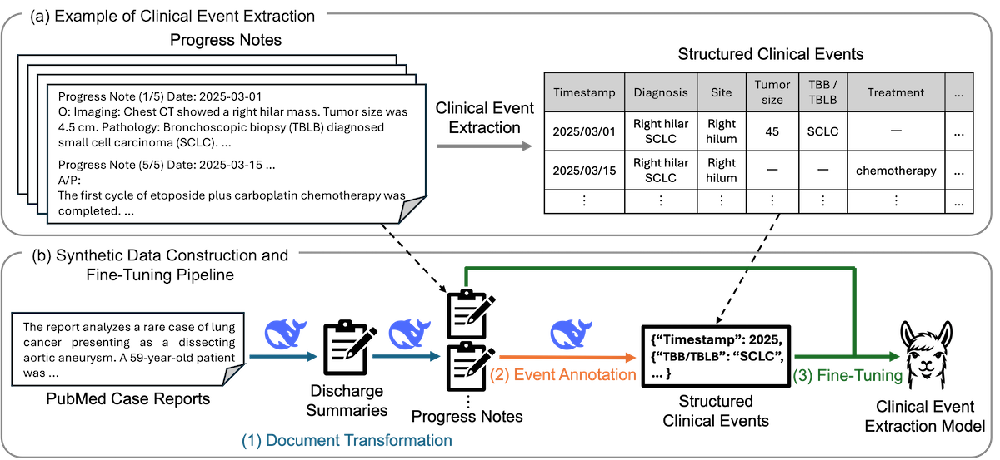

# Synthetic data for clinical event extraction in lung cancer progress notes

Code, prompts, and synthetic clinical documents accompanying the manuscript:

> Himi Y, et al. Clinical Event Extraction in Lung Cancer Progress Notes Using Synthetic Data Derived From Case Reports: Development and Evaluation Study. (submitted to JMIR AI)

The study builds an LLM-based pipeline that transforms publicly available PubMed case-report abstracts into Japanese synthetic discharge summaries and progress notes, annotates the progress notes with structured clinical events, and uses the resulting document–event pairs to fine-tune a small language model (Llama-3.1-Swallow-8B-Instruct-v0.5) for clinical event extraction.



**(a)** Clinical event extraction: information in progress notes is organized as structured clinical events anchored to a timestamp (shown in English for illustration; the data are in Japanese). **(b)** Pipeline: (1) public case reports are transformed into discharge summaries and progress notes, (2) the progress notes are automatically annotated as structured clinical events, and (3) the document–event pairs are used to fine-tune a clinical event extraction model. The LLM (steps 1 and 2) is used only once, on public case reports; only the fine-tuned SLM (step 3) is intended to run inside the hospital.

## Repository layout

```
.
├── data/
│   ├── synthetic/
│   │   ├── discharge_summaries.jsonl   4365 synthetic discharge summaries (released)
│   │   ├── progress_notes.jsonl        4365 synthetic progress notes (released)
│   │   └── pmids.txt                   PMIDs of the source case reports
│   ├── icl_examples/
│   │   └── icl_example_ids.tsv         IDs of the 20 J-ClinicalBench in-context examples
│   └── LICENSE                         CC BY 4.0 (synthetic documents)
├── src/
│   ├── prompts/                        final prompts and annotation guideline
│   ├── genpipe/                        document generation and annotation (DeepSeek API)
│   ├── preprocess_synthetic_data.py    structural filtering of generated pairs
│   ├── trainpipe/                      QLoRA fine-tuning
│   ├── inferpipe/                      inference
│   ├── score_lung.py, eval_schema.py   event-level scoring
│   └── paper_revision/                 bootstrap CIs, permutation tests, result tables
├── scripts/
│   ├── generate/, train/, infer/, score/   wrappers for each stage
│   └── experiments/                    one directory per experiment (scripts/README.md)
├── docs/figure1.png
├── LICENSE                             Apache-2.0 (code)
└── pyproject.toml, uv.lock
```

## Data

### Synthetic documents (released)

| File | Content |
|---|---|
| `data/synthetic/discharge_summaries.jsonl` | 4365 synthetic discharge summaries (Japanese), one JSON object per line with `pmid` and `discharge_summary` |
| `data/synthetic/progress_notes.jsonl` | 4365 synthetic progress notes (Japanese), one JSON object per line with `pmid` and `progress_note` |
| `data/synthetic/pmids.txt` | PMIDs of the 4365 source case reports, one per line |

The released documents are the 4365 examples retained after structural filtering (Dsyn in the manuscript). Each discharge summary and progress note is linked to its source case report through the PMID, so the generated content can be checked against the original abstract. Each `progress_note` field holds the sequence of notes for one case, with each note headed `Progress note (i/N)` and a date.

Example records (truncated):

```json
{"pmid": "493026", "discharge_summary": "年齢: 74\n性別: 男性\n入院日: [補完情報]2025年[補完情報]月[補完情報]日\n退院日: [補完情報]2025年[補完情報]月[補完情報]日\n...\n退院時診断: 肺がん\n...\n主訴または入院理由: 高アミラーゼ血症 [補完情報]\n入院までの経過（現病歴・既往歴・入院時現症など）: 74歳の男性。血液、尿、および胸水 ..."}
```

```json
{"pmid": "493026", "progress_note": "Progress note (1/5)\n\nDate: 2025-06-10\n\nS\n高アミラーゼ血症の精査目的で入院となった。自覚症状は特にない [補完情報]。\n\nO\n意識清明。バイタルサイン：体温 36.8℃、心拍数 78/分、整、血圧 128/76 mmHg、呼吸数 16/分、SpO2 98% (室内気) [補完情報]。\n胸部聴診：右肺野に呼吸音減弱を認める [補完情報]。 ..."}
```

**Tag for added content.** During generation the LLM was instructed to enrich the documents with clinically plausible details not present in the source abstract and to mark such content with the tag `[補完情報]` ("supplemented information"). The tags are retained in the released documents, as in the training data used in the study. Neither the added details nor the placement of the tags were manually verified.

### In-context examples from J-ClinicalBench

The 20 physician-authored simulated discharge summary–progress note pairs used as in-context examples for document generation are part of J-ClinicalBench and are not redistributed here. `data/icl_examples/icl_example_ids.tsv` lists their case IDs and file names under `data/raw/DS/` and `data/raw/PN/` of the J-ClinicalBench repository (https://github.com/seiji-shimizu/J-ClinicalBench-release).

> Shimizu S, Nishiyama T, Shohei H, Himi Y, Wakamiya S, Yanagisawa Y, Tsuchiya M, Hori S, Aramaki E. J-ClinicalBench: A Benchmark for Evaluating Large Language Models on Practical Clinical Tasks in Japanese. LREC 2026;419–430.

### Not released

The following were created under a joint research agreement and are subject to its confidentiality terms:

- the structured clinical event annotations of the synthetic progress notes,
- the 5 simulated progress notes (with annotations) used as in-context examples for event annotation,
- the evaluation data (96 physician-authored simulated progress notes and their annotations).

Fine-tuned adapters are not released. Consequently, the annotation stage and the fine-tuning experiments cannot be re-run from the released materials alone; the code is provided for reference and for use with your own annotated data. Aggregated results are reported in the manuscript and its supplementary materials.

## Code

| Path | Content |
|---|---|
| `src/prompts/` | Prompts used for the final pipeline: Japanese translation of the abstract (`gen_case_reports_ja.toml`), discharge summary generation (`gen_discharge_summaries_bias.toml`), progress note generation (`gen_progress_notes_bias.toml`), event annotation (`gen_annotation_noae_v2.toml`), zero-/few-shot extraction (`gen_zero-shot_noae_v2.toml`), and the annotation guideline (`guideline_lung_noae_v2.txt`) |
| `src/genpipe/` | Synthetic document generation and annotation via the DeepSeek API |
| `src/preprocess_synthetic_data.py` | Structural filtering of the generated document–event pairs |
| `src/trainpipe/`, `src/inferpipe/` | QLoRA fine-tuning and inference |
| `src/score_lung.py`, `src/eval_schema.py` | Event-level scoring (Hungarian matching, micro-/macro-F1) |
| `src/paper_revision/` | Bootstrap confidence intervals, permutation tests, and result tables |
| `scripts/` | Shell wrappers for each stage and experiment; `scripts/README.md` maps each experiment directory to a condition in the manuscript |

### Pipeline

1. **Document transformation** (`scripts/generate/run_case_report_ja.sh`, `run_discharge_summary.sh`, `run_progress_note.sh`): each lung cancer case-report abstract is translated into Japanese, then transformed into a discharge summary and progress notes. Discharge summary generation uses 3 J-ClinicalBench discharge summaries as examples; progress note generation uses 3 discharge summary–progress note pairs.
2. **Event annotation** (`scripts/generate/run_annotation.sh`): the progress notes are annotated with structured clinical events using 2 annotated example notes per input (not released).
3. **Preprocessing** (`src/preprocess_synthetic_data.py`): undefined keys, values outside the candidate lists, timestamp-only events, duplicate events, and examples with empty annotations are removed, and selected site expressions are normalized (4762 → 4365 examples).
4. **Fine-tuning and evaluation** (`scripts/experiments/`): zero-shot, FT-Synthetic, FT-Manual, and FT-ALL conditions with 5-fold cross-validation on the manual data and 5 seeds (`08_multiseed_robustness`), the few-shot SLM baseline (`05_few_shot`), and the prompted 120B LLM baselines (`09_llm_baselines`).

All generation and annotation steps were run through the DeepSeek API (DeepSeek-V3.2, non-thinking mode) with `DEEPSEEK_API_KEY` set in the environment. Fine-tuning and inference use a single GPU with 4-bit QLoRA; the prompted 120B baselines used 3 GPUs (96 GB each).

### Setup

```bash
uv sync
```

Python 3.13 or later is required. Model checkpoints, input data paths, and output directories are set in `config/*.env` under each experiment directory (placeholders such as `/path/to/...` must be replaced).

## License

- Code, prompts, and scripts: [Apache License 2.0](LICENSE).
- Synthetic documents under `data/` (`discharge_summaries.jsonl`, `progress_notes.jsonl`, `pmids.txt`): [Creative Commons Attribution 4.0 International (CC BY 4.0)](data/LICENSE). The documents were generated by an LLM from PubMed case-report abstracts and are provided as is, without any warranty of clinical accuracy.

## Citation

If you use the synthetic documents or the code, please cite the manuscript above and J-ClinicalBench for the in-context examples.
